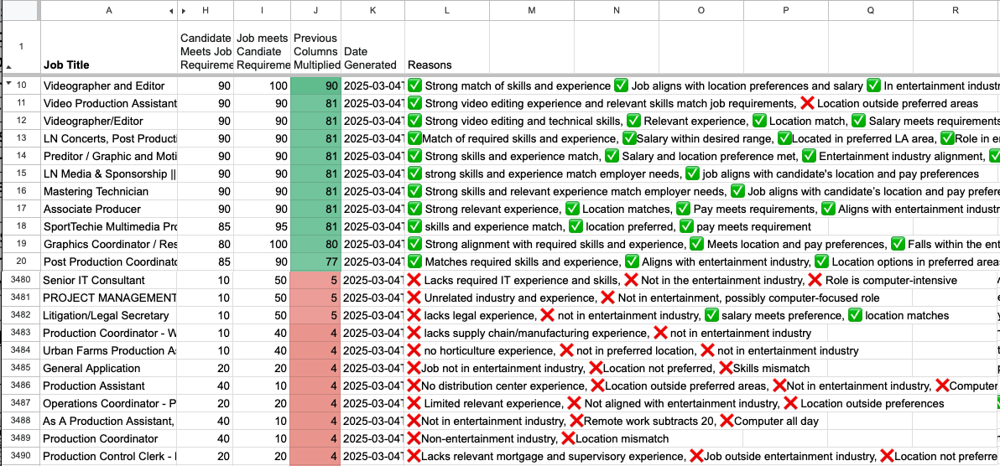

# JobMatchAI

JobMatchAI is a Typescript application that removes irrelevant and unqualified jobs using ChatGPT and Google Sheets. This lets you focus on relevant jobs. 


Output: 



## Prerequisites

- Node.js (v16 or higher)
- NPM or Yarn
- Google Cloud Service Account credentials for accessing Google Sheets
- ChatGPT or Deep-seek API Key
- Apify API Key

## Installation

1. Clone the repository:

   ```bash
   git clone git@github.com:USERNAME_HERE/JobMatchAI.git
   cd JobMatchAI
   ```

1. Install dependencies:

   ```bash
   npm install
   ```
1. Make a copy of this Google Spreadsheet and delete all the rows https://docs.google.com/spreadsheets/d/1x1e6GtfTl7LYh65MhVQtKApvwfsIdhXpFGPmXd57C8c/edit?gid=1330056534#gid=1330056534 The columns in the spreadsheet are:
   - Job Title	
   - Company	
   - Location	
   - Job URL	
   - Pay	
   - Full-time/Contract	
   - Source	
   - Candidate Meets Job Requirements	
   - Job Meets Candidate Requirements	
   - Previous Columns Multiplied	
   - Date Generated	
   - Reasons for score																				

1. Edit the sharing settings of the Google Sheet to allow the service account to read and write to the sheet. Or just allow everyone with the link to read and write to the sheet. 

1. Set up environment variables:
   Rename the `.env.example` file to `.env` and add your API keys:

   Note: The Deepseek part of the program is not finished. Start with OpenAI. 
   ```env
   APIFY_API_KEY=[apify api key]
   SPREADSHEET_ID=[google sheet spreadsheet id]
   DEEPSEEK_API_KEY=[deep-seek ai api key]
   OPENAI_API_KEY=[open ai api key]
   USE_GPT=[true or false]
   USE_DEEPSEEK=[true or false]
   DEBUG_MODE=[true or false]
   ```
   
1. Sign up for Apify and start the Basic subscription. 
1. Modify the Apify Job Scraper API Inputs 
   - For LinkedIn, go to https://console.apify.com/actors/hKByXkMQaC5Qt9UMN/input, fill in the form, then click "JSON" at the top of the page, and copy it into the local file "apify_inputs/hKByXkMQaC5Qt9UMN_production_assistant_US.json"
   - For ZipRecruiter, go to https://console.apify.com/actors/vQO5g45mnm8jwognj/input, fill in the form, then click "JSON" at the top of the page, and copy it into the local file "apify_inputs/vQO5g45mnm8jwognj_video_producer_SF.json"
   - For Indeed, go to https://console.apify.com/actors/qA8rz8tR61HdkfTBL/input, fill in the form, then click "JSON" at the top of the page, and copy it into the local file "apify_inputs/qA8rz8tR61HdkfTBL_videographer_SF.json"
   - You can add add more json files in the apify_inputs directory. You can add multiple json files to run multiple Apify jobs in parallel. The file names have to start with the actor ID (e.g. hKByXkMQaC5Qt9UMN) 
1. Rename "candidate_summary.example.txt" to "candidate_summary.txt" and add your resume and job preferences.

   ```
   Work Experience:
   Education:
   Hobbies: 

   Job Preferences:
   - Preferred Locations: Bay Area + 100 miles, Los Angeles area + 100 miles, San Diego area + 100 miles, New York area + 100 miles. Second choice is US west coast. 
   - Not a student so ignore internships unless it says something like "school enrollment not required"
   - Not a manager so ignore supervisor/director positions
   - Languages: English
   ```

1. Go to Google Cloud Console and create a service account and download the google_service_account_credentials.json file and put it in this directory.

## Usage

Compile the Typescript:

```
npx tsc --watch
```

In another terminal, start the application:

```bash
node dist/index.js
```

## Dependencies

- [apify-client](https://www.npmjs.com/package/apify-client)
- [dotenv](https://www.npmjs.com/package/dotenv)
- [googleapis](https://www.npmjs.com/package/googleapis)
- [openai](https://www.npmjs.com/package/openai)
- [typescript](https://www.npmjs.com/package/typescript)

## Contributing

Contributions are welcome! Please fork this repository and submit a pull request for review.

